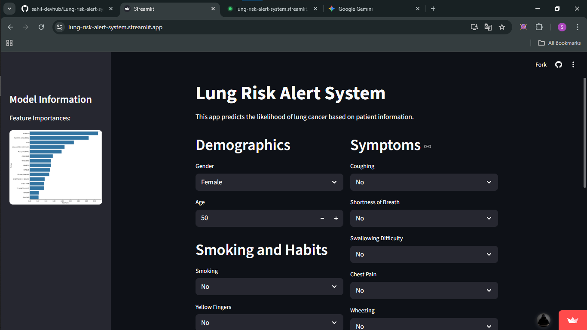
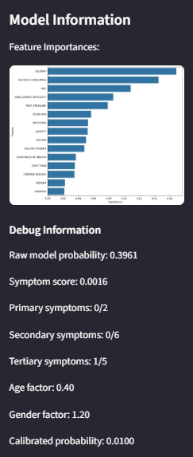

# 🩺 Lung Risk Alert System


An AI-driven health diagnostic tool designed to provide early-stage lung cancer risk assessment. This platform bridges the gap between complex medical screenings and common accessibility, providing instant insights based on lifestyle and symptoms.

---

## 📌 The Problem & Motivation

### The Challenge
Quality healthcare and early diagnostic tests (like CT scans and biopsies) are often **expensive and inaccessible** to many people, especially those from lower-income backgrounds. Because of the high costs and lack of awareness, many individuals ignore early symptoms, leading to late-stage diagnoses where treatment is difficult.

### The Solution
I built the **Lung Risk Alert System** to serve as a "First-Line Screening" tool. 
* **Accessibility:** It’s free and easy to use for anyone with a smartphone/computer.
* **Awareness:** It helps people understand how symptoms like fatigue, wheezing, or even peer pressure (related to smoking) contribute to their risk profile.
* **Actionable Data:** While not a replacement for a doctor, it provides a high-accuracy "Alert" that can encourage a user to seek professional medical help before it's too late.

---

## 📸 Project Gallery

### 🖥️ User Interface & Prediction
The landing page is designed for simplicity, allowing users to receive instant risk alerts without medical expertise.

| **Landing Page** | **Prediction Output** |
| :---: | :---: |
|  |  |

---

### 📊 Model Analytics & Data Insights
The system is backed by a high-precision machine learning model and detailed data correlation analysis.

| **Model Performance Report** | **Symptoms Grouping** |
| :---: | :---: |
|  |  |

| **Visual Data Representation** |
| :---: |
|  |---

## 🛠️ Tech Stack

* **Language:** Python
* **Framework:** [Streamlit](https://streamlit.io/) (For the interactive Web UI)
* **Machine Learning:** Scikit-Learn, Random Forest Classifier
* **Data Handling:** Pandas, NumPy
* **Visualization:** Matplotlib, Seaborn
* **Deployment:** Streamlit Cloud

---

## 🚀 Key Features

- **Instant Risk Assessment:** Get results in seconds by answering a few lifestyle and health questions.
- **High Accuracy:** Built on a verified survey dataset of lung cancer patients.
- **Categorical Analysis:** Analyzes factors like Age, Gender, Smoking, Anxiety, Peer Pressure, and Chronic Diseases.
- **Zero Cost:** A platform designed for the community to check their health risk without financial burden.

---

## ⚙️ Installation & Usage

To run this project locally:

1. **Clone the repository:**
   ```bash
   git clone [https://github.com/sahil-devhub/lung-risk-alert-system.git](https://github.com/sahil-devhub/lung-risk-alert-system.git)
   cd lung-risk-alert-system
   ```
2. **Install dependencies:**
  ```
  pip install -r requirements.txt
  ```
3. **Run the App:**
  ```
  streamlit run app.py
  ```
## 📂 Project Structure
  ```
  ├── app.py                  # Main Streamlit application
  ├── model_training.ipynb    # Jupyter notebook for Model Training & EDA
  ├── lung_cancer_model.pkl   # Pre-trained ML Model
  ├── feature_reference.pkl   # Encoded feature mapping
  ├── requirements.txt        # Project dependencies
  └── assets/                 # Screenshots and images
  ```
## ⚠️ Disclaimer
  ```
  This application is an AI-based risk assessment tool and is intended for educational and awareness purposes only. It does not provide a formal medical diagnosis. Users should always consult with a qualified healthcare professional for medical advice and screenings.
  ```

## 👨‍💻 Developed By
  ```
  Sahil Kumar AI & Machine Learning Enthusiast
  ```
